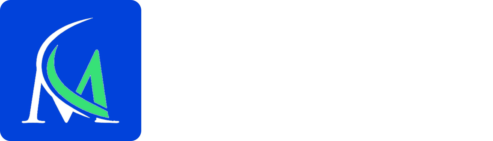

 

    
  </a>

 

MedBot is an open-source chatbot. It allows you to create advanced chatbots visually, embed them anywhere on your web/mobile apps, and collect results in real-time

<h3 align="center">
  <b><a href="#">Try MedBot</a></b>
  •
  <b><a href="#">Docs</a></b>

## Features

MedBot makes it easy to create advanced chatbots. It provides the building block that are adaptable to any business use case.

**Chat builder** with 34+ building blocks such as:

- Bubbles: Text, Image / GIF, video, audio, embed.
- Inputs: Text, email, phone number, buttons, picture choice, date picker, payment (Stripe), file picker... inputs
- Logic: Conditional branching, URL redirections, scripting (Javascript), A/B testing
- Integrations: Webhook / HTTP requests, OpenAI, Google Sheets, Google Analytics, Meta Pixel, Zapier, Make.com, Chatwoot, More to come...

**Theme** your medbot to match your brand identity:

- Customize the fonts, background, colors, roundness, shadows, and more
- Advanced theming with custom CSS.
- Reusable theme templates

**Share** your medbot anywhere:

- Custom domain
- Embed as a container, popup, or chat bubble easily with the native JS library.
- Blazing fast embed lib. No iframe, no external dependencies, no performance impact.
- Executable with HTTP requests

Collect your **Results** and get insights:

- In-depth analytics with drop-off rates, completion rates, and more
- Export results to CSV
